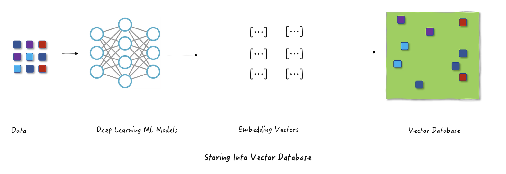

# Embeddings: The Foundation of Vector Databases

Before diving into the ins and outs of vector databases, let's lay some groundwork. We need a shared understanding of what embeddings are, why they've become so ubiquitous, and how they're created.

 

## What are embeddings?

At their core, embeddings are dense vectors of floating-point numbers—dense meaning they typically don't have empty or zero values. But why are these numbers so powerful? Because they're more than just numbers; they're compact, numerical representations of complex things like words, ideas, images, or sounds. They distill rich, meaningful information into a format that computers can work with efficiently, capturing the essence of our world in numbers.

 

## What are the different types of embeddings?

Embeddings come in many forms, each tailored to represent different types of data. Here are a few common ones and where they're used:

- **Entity/ID/Category Embeddings**: These represent discrete entities, like product IDs, user IDs, or categories. For example, in a recommendation system, embeddings for users and products help capture preferences and relationships to suggest the best matches.

- **Word Embeddings**: These map individual words into a continuous vector space where similar words are closer together. Models like Word2Vec or GloVe are classic examples, enabling applications like synonym detection or text clustering.

- **Sentence Embeddings**: These represent entire sentences or phrases in a way that captures their meaning. They're used for tasks like semantic search (finding documents with similar ideas) or text summarization.

- **Image Embeddings**: These are generated from images and represent visual features. For instance, an e-commerce site might use image embeddings to find products that look similar or enable visual search where you search by uploading a photo.

- **Audio Embeddings**: These capture the features of sound, like pitch, tone, and rhythm. They're useful in applications like music recommendation, speech recognition, or identifying similar audio clips.

Each type of embedding is specialized for its domain, condensing complex data into a form that's easier to process and compare. This versatility is why embeddings are the backbone of so many AI-driven systems today.

 

## How do we learn embeddings from data?

Ok so now that we know how useful embeddings can be, we naturally start to ask how do we learn / produce these representations. Embeddings are usually (but not always) learned through training a neural network. For instance, take a convolutional neural network (CNN) trained to classify images. During training, the network's internal weights learn to represent the features of images in ways that group similar ones together based on their labels. Once trained, you can input an image into the network, stop just before the final output layer, and extract the rich representation stored in that penultimate layer. This extracted vector is the image's embedding.

It's also interesting to note here that embeddings come in different sizes. The length of an embedding depends on the width of the final layer in the neural network that created it, typically ranging from 128 to 2000 numbers.

- **Larger embeddings** pack in more detail and information but need more memory and computing power.
- **Smaller embeddings** are lighter and faster to work with but might leave out some finer details.

It's all about trade-offs: choosing the right size depends on whether you need efficiency or richness of representation.

 

# What Problems do Vector Databases Solve?

Now that we understand embeddings, it's easier to see why vector databases are such a game-changer—but let's break it down a bit more. Traditional databases come in two flavors: they either enforce strict schemas for structured data or handle unstructured data like blobs and documents. The problem? Neither is built for the kind of fuzzy, non-exact searches we need today—things like finding similar concepts, matching image content, or identifying sounds. They just don't get semantics or nuance.

 

# Under the Hood: Vector Search

Now that we know what embeddings are, how to create them, and the problems vector databases solve, let's dig into how search actually works in a vector database—the magic that powers all those incredible use cases.

First to understand the boarder process, let's take the example of a users search query to find similar items. How does this process look like with a vector database? The user types a query into the search bar, which is sent to a neural network that generates an embedding from the raw text. This embedding is then used to perform a nearest neighbour search in the vector database, returning the top K items that most closely match the user's query.

 

## How to search at scale

Every database needs a way to find data quickly and efficiently, especially when dealing with massive datasets. Traditional databases rely on indexes, which are essentially shortcuts to locate rows or documents based on things like IDs or values. But when it comes to vectors, the game changes. Instead of exact matches, we're searching for "nearest neighbors"—the vectors closest to a given query in high-dimensional space.

But finding those "nearest neighbors" isn't as simple as it sounds. The naive approach—calculating the exact distance between every vector and your query—works fine for small datasets but completely falls apart at scale. Imagine comparing millions or even billions of vectors one by one, it's computationally expensive and painfully slow. This is why exact nearest neighbors isn't practical for real-world applications, where speed and scalability are key. In the next we will explore how to solve with with Approximate Nearest Neighbours (ANN).

 

## Index Building for Approximate Nearest Neighbours

So now that we know the naive approach of exact nearest neighbours won't work, the question becomes, how can we organise our embeddings so that we can retrieve the best matches at scale and with low latency. Enter ANN, which now approximates the search...

> The key idea shared by these algorithms is to find the NN with high probability, instead of probability = 1.

So we see ANNs trade off accuracy for speed and space efficiency but how does this work under the hood? Well ANNs are just a broad class of algorithms and there are many ways to implement it. In general each of the methods falls into the broad categories of:

- Hashing
- Graph
- Quantisation
- Tree / Space Partition Methods

In this section we will take a quick look at an example from each category of ANN implementations.

 

# Exploring ANN Implementations

 

## Hashing: Locality Sensitive Hashing

Locality Sensitive Hashing (LSH) turns the traditional notion of hashing on its head. While conventional hash functions try to avoid collisions at all costs, LSH actually embraces them, but in a smart way. The key insight is to design hash functions that deliberately cause similar items to collide into the same bucket with high probability.

Think of it like this: instead of spreading everything out evenly (as traditional hash functions do), LSH creates a kind of "neighborhood map" where similar items are likely to end up living next door to each other in the same bucket. This means when you're searching for similar items, you don't need to scan the entire dataset, you can just look in the relevant bucket.

Here's what makes LSH work:
- **Intentional Collisions**: Unlike traditional hashing that tries to minimize collisions, LSH maximizes them for similar inputs
- **Probability-Based**: Similar items have a high probability of hashing to the same bucket
- **Multiple Hash Functions**: Usually uses multiple hash functions to improve accuracy and handle edge cases

The most common implementation approach involves:
1. **Shingling**: Breaking down the input into smaller overlapping pieces
2. **MinHashing**: Creating a compact signature that preserves similarity
3. **Banding**: Grouping these signatures to balance between precision and recall

 

 

## Graph: Hierarchical Navigable Small Worlds

The most widely used based approach is Hierarchical Navigable Small World (HNSW) [[^3]], which offers an efficent solution to the nearest neighbor search problem by creating a multi-layered network structure. It's gained it's status as it's one of the most effective approaches for vector search. To concetulaise this approach, think of it like a hierarchical map: you first zoom out to find the general area (coarse layer), then progressively zoom in (finer layers) until you locate exactly what you're looking for.

 

The key insight of HNSW is building connections between similar items across different layers:
- **Multi-Layer Structure**: Creates a hierarchy from coarse to fine-grained connections
- **Navigable Paths**: Similar items are connected, creating efficient search paths
- **Logarithmic Scaling**: Search complexity grows with log(N) rather than linearly
- **Progressive Refinement**: Searches start broad and become more precise

 

 

The search process in HNSW is elegantly simple:
- We build layers of graphs, with the top layers being more sparse and the lower layers being more dense. 
- At query time, we Start at the sparsest (top) layer with long-range connections
- At each layer, greedily traverse the graph until finding the vector that most resembles our query vector, i.e we reach a local minimum
- Then we drop down to a denser layer and repeat, using the previous best match as starting point
- Continue until reaching the bottom layer, which contains the most precise connections

This layered approach combines the speed of coarse navigation in upper layers with the precision of dense connections in lower layers, making HNSW one of the most efficient ANN implementations available.

 

## Product Quantisation

Product Quantization is primarily a compression technique for embeddings, but it's often used in combination with other ANN approaches to create more efficient search systems. For example, it can be combined with IVF (Inverted File Index) to create IVFPQ indexes that offer both fast search and memory efficiency.

> Product quantization (PQ) is a popular method for dramatically compressing high-dimensional vectors to use 97% less memory, and for making nearest-neighbor search speeds 5.5x faster ... [[^1]]

In PQ, we break down vectors into subvectors. For each subvector space, we apply a clustering algorithm (like k-means) and assign the subvector to the closest centroid. In this image, there's 3 centroids per subspace. The centroids are themselves vectors (quantized subvectors). But to save space we assign those centroid subvectors IDs, called reproduction IDs. Then all the learned IDs for all subvectors are concatenated to represent the original vector.

 

 

Key considerations in PQ implementation:

- Choice of \(k\) for the number of centroids:
    - **Higher k**: Better reconstruction, higher memory use, and more computation
    - **Lower k**: Lower memory and faster search but potentially worse reconstruction quality
- Choosing the number of subvectors (or subspaces) \(p\)
- Clustering algorithm selection (typically k-means)

 

## Tree Based / Space Partitioning Methods

Tree and space partitioning methods take a divide-and-conquer approach to organizing vectors. These methods break down the high-dimensional space into smaller regions, making search more efficient by only exploring relevant portions of the space. Let's take a look at the most used space based partitioning method:

 

### Inverted File Index (IVF): Space Partitioning

IVF uses clustering to partition the high-dimensional vector space. The process starts by running k-means clustering on a sample of vectors to identify centroids in the N-dimensional space. Each centroid represents the center of a cluster, and the boundaries between clusters form naturally where the distance to one centroid becomes greater than the distance to another. This creates a partition of the space where each point belongs to the cluster of its nearest centroid.

 

 

The beauty of IVF lies in its simplicity. During search, we first find the closest centroids to our query vector, and then only search through the vectors in those clusters. The `nprobe` parameter controls how many nearest clusters we explore - a crucial tuning parameter for handling edge cases. For example, if a query vector falls near the boundary between clusters, we might miss relevant results by only searching one cluster. By increasing `nprobe`, we can search neighboring clusters as well, trading speed for accuracy.

 

 

IVF is particularly powerful because:
- Simple to implement: just k-means clustering plus basic nearest neighbor search
- Efficient: dramatically reduces the search space
- Flexible: `nprobe` parameter allows easy accuracy/speed tuning
- Composable: works well with other techniques like Product Quantization

 

# Challenges in Vector Databases

Vector databases face several key challenges that need to be addressed for optimal performance and usability:

- **Index Building**: The initial process of organizing vectors into efficient search structures (like HNSW graphs or IVF clusters) can be computationally expensive and time-consuming, especially for large datasets.

- **Reindexing**: As new vectors are added, the index structure needs updating. While methods like IVF allow for incremental updates by assigning vectors to existing clusters, this can lead to degraded performance over time as the original clustering becomes less optimal.

- **Memory Usage**: High-dimensional vectors consume significant memory - even modest datasets (1M vectors) can require several GBs. Techniques like Product Quantization and dimensionality reduction help, but involve trade-offs between memory efficiency and search accuracy.

- **Filtering**: Combining traditional database filtering (e.g., metadata queries) with vector similarity search is challenging. The index structures optimized for vector search don't naturally support these additional constraints.

- **Heterogeneous Vectors**: Supporting different types of vectors (text, image, audio) with varying dimensions and distance metrics in the same database requires careful architectural decisions and can impact performance.

 

# The VectorDB Ecosystem & Why Standalone Vector Databases Might Be The Wrong Abstraction

 

During my research on vector databases, I came across this article that challenges the current trend of using standalone vector databases [[^2]] which I highly recommend reading. While these specialized databases excel at vector similarity search, they operate in isolation from the systems that store the original source data. This separation means that every time source content is updated in your primary database, a corresponding update needs to be manually propagated to the vector database to keep the embeddings in sync, a headache indeed! Data is constantly changing in production systems and this creates a complex web of synchronization tasks and potential failure points.

 

## The Core Problem: Independent vs. Derived Data
The core argument laid out in the article is that treating embeddings as independent data, rather than derived data (think of how a database index is automatically updated when its source table changes, versus treating embeddings as separate entities that need manual synchronization with their source content), creates unnecessary complexity and synchronization challenges.

Consider a typical RAG system: you might use a vector database for embeddings, another database for metadata and application data, and possibly a separate system for lexical search. This leads to complex orchestration challenges, with engineering teams frequently struggling with embedding synchronization issues. 

 

## A Better Approach: The Vectorizer Abstraction
An alternative approach proposed is treating embeddings more like database indexes through a "vectorizer" abstraction, where the database system automatically maintains the relationship between source data and its embeddings. This could eliminate many of the maintenance headaches that plague current implementations, especially in production systems where data is constantly changing and evolving.

A practical solution to this challenge is using PostgreSQL with the `pgvector` extension, combined with a vectorizer approach (implemented by `pgai`). PostgreSQL already excels at handling:
- Structured data
- Text search
- JSON documents

By adding vector similarity search capabilities through `pgai` and automated embedding management through vectorizers, you get the best of both worlds:
- A mature, battle-tested database system
- Automatic synchronization between source data and embeddings
- Elimination of complex orchestration between multiple databases
- Performance and flexibility needed for modern AI applications

 

# Wrap Up

We've taken a quick tour through the vector databases landscape, starting from the fundamental concept of embeddings to the intricate details of how these systems work under the hood. Now let's wrap this up by laying out the key takeaways for you:

 

1. **Embeddings are the Foundation**: We learned how these dense vectors can capture the essence of anything text, images, audio in a format that computers can efficiently process and compare.

2. **Vector Search is Complex**: Simple bruteforce approaches don't scale, leading to the development of sophisticated approximate nearest neighbor (ANN) algorithms that trade perfect accuracy for dramatic speed improvements.

3. **Multiple Implementation Approaches**: From locality-sensitive hashing to hierarchical navigable small worlds, each approach offers different trade-offs between speed, accuracy, and memory usage.

4. **Real Challenges Exist**: Vector databases face significant challenges around indexing, memory optimisation, filtering, and supporting different vector types. These challenges are actively being addressed through various strategies.

5. **The Ecosystem is Evolving**: The vector database landscape is rapidly changing, with different approaches emerging to handle vector search capabilities.

 

I hope this review has given you a good first taste of the world of vector DBs and some of the challenges they present. 

 

See you in the next one! 

   

### References
---

[^1]: [Product Quantization: Compressing high-dimensional vectors by 97%](https://www.pinecone.io/learn/series/faiss/product-quantization/)

[^2]: [Vector Databases Are the Wrong Abstraction](https://www.timescale.com/blog/vector-databases-are-the-wrong-abstraction)

[^3]: [Efficient and robust approximate nearest neighbor search using Hierarchical Navigable Small World graphs](https://arxiv.org/pdf/1603.09320)
